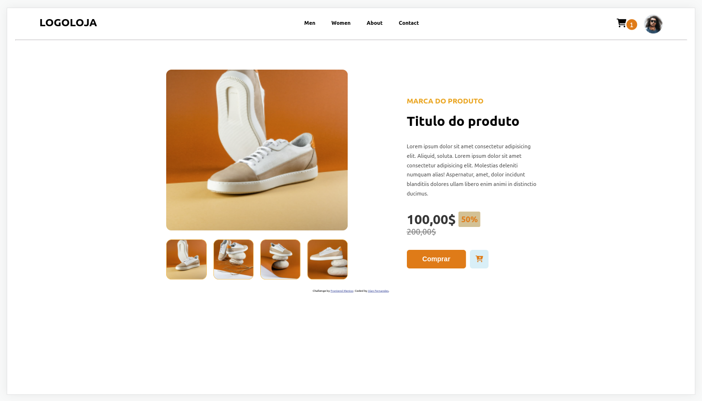

# Pagina de E-commerce

Esse Projeto foi desenvolvido para colocar em prática os conhecimentos em HTML e CSS 

O Objetivo foi criar uma pagina de produto de um E-commerce usando tecnologias simples como HTML5 e CSS5 além de englobar os conceitos de: como estruturar um layout, técnicas de CSS3 com contêineres e variáveis, como posicionar os elementos com Flexbox.

Link: https://allanfernds.github.io/shoes-page/
## Tecnologias utilizadas
* HTML5
* CSS
* Fontawesome

## Layout do projeto

### Autor

LinkedIn:https://www.linkedin.com/in/alan-fernandes-03096317b/

Instagram: https://www.instagram.com/_alanfernds/

E-mail: alanfernandes.mm@gmail.com

